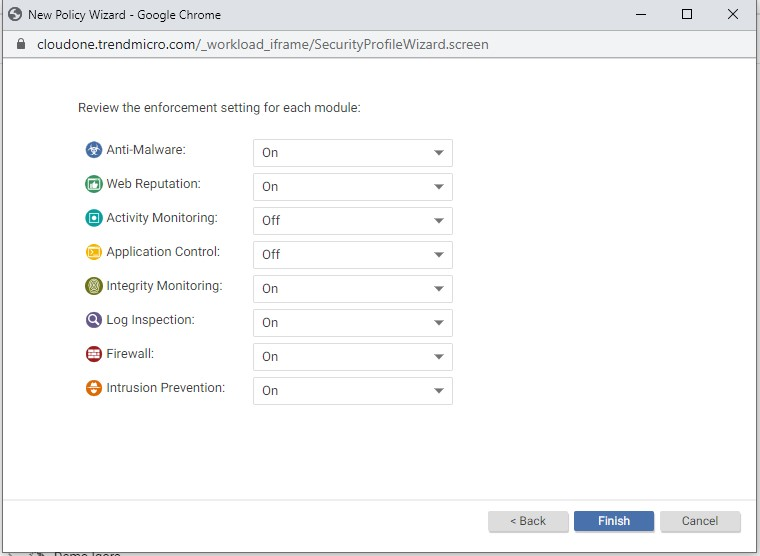
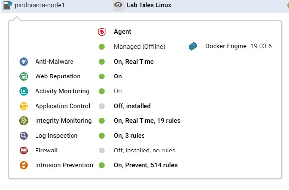
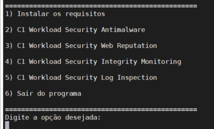
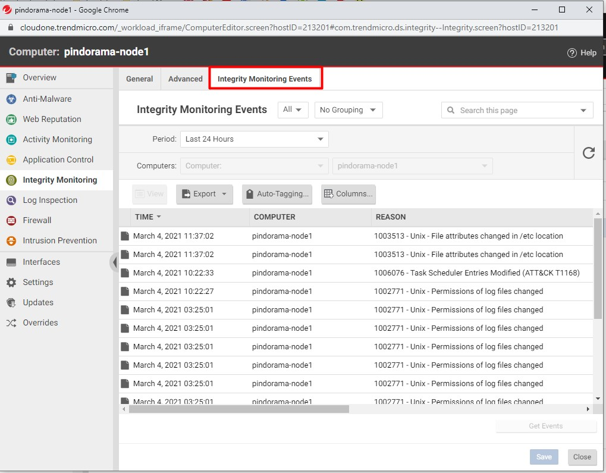
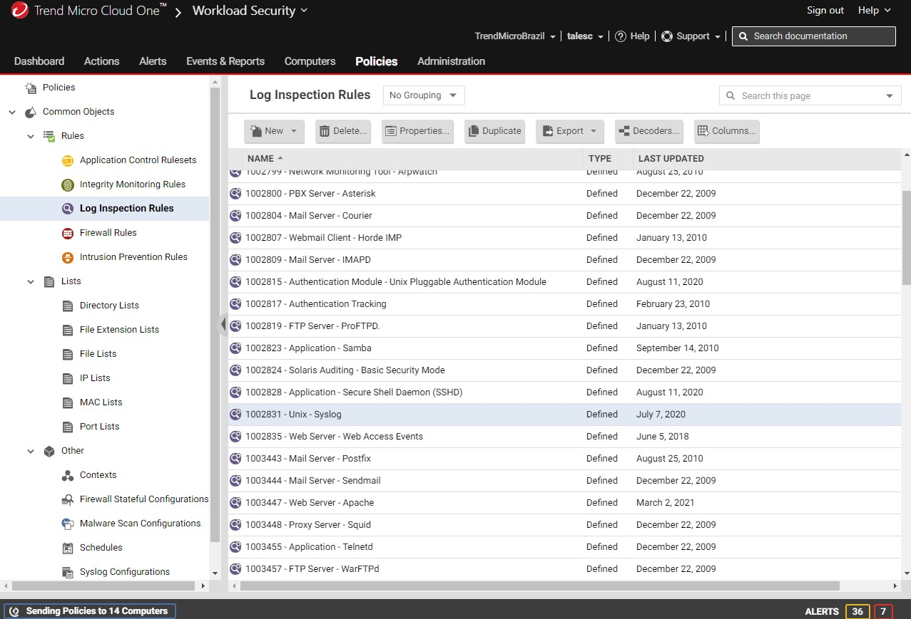

# TestingC1WorkLoadSecurityModules
Um guia de como testar os módulos Cloud One Workload Security.

O Workload Security é composto pelos seguintes modulos:

- Anti-Malware
- Web Reputation	
- Application Control
- Integrity Monitoring
- Log Inspection
- Firewall
- Intrusion Prevention

# Ambiente de teste
- Ubuntu 18.04

Para executar os testes o pré-requisito é possuir uma conta no Cloud One (sem custo) https://cloudone.trendmicro.com/
- Documentação https://cloudone.trendmicro.com/docs/workload-security/
- Liberar as seguintes portas https://cloudone.trendmicro.com/docs/workload-security/communication-ports-urls-ip/

# Instalando o agent
Copie o arquivo .sh para o servidor de destino aplique uma permissão de execução (chmod +x) e inicie a instalação.

 </img>

# Habilitando os módulos

Na console do Cloud One Workload Security navega no menu Policies > New > Coloque um nome (Inherit from: None) > Não iremos basear a configuração em nenhum computador.
Habilite todos os módulos com execção do Firewall e Application Control.

Selecione a opção "Open Policy Details on 'Close"

 </img>

Recomendações de configuração:

Anti-Malware: Aggressive Configuration e Schedule Every Day All Day
Web Reputation: Security Level Medium
Integrity Monitoring: Habilitar o Real Time e em Recommendations escolher a opção yes
Log Inspection: Recommendations escolher a opção yes
Intrusion Prevention: Recommendations escolher a opção yes
Settings: Heartbeat mudar para 1 minuto

# Executando o Scan de Recomendação

O Workload Security executa verificações de recomendação em computadores para identificar vulnerabilidades conhecidas no Sistem Operacional e nas Aplicações.

As Varreduras de Recomendação também podem ajudar a automatizar a atribuição de regras associadas não apenas ao Módulo de Prevenção de Intrusão mas também ao módulo de Monitoramento de Integridade módulo de Inspeção de Logs.

O Recommendation Scans identifica:
- Sistema operacional
- Aplicativos instalados
- Registro do Windows
- Portas abertas
- Listagens de diretórios
- O sistema de arquivos
- Executando processos e serviços
- Usuários

Clique em Computers, procure pelo servidor e siga a instrução abaixo:

 </img>

Repare que após a conclusão do Scan de Recomendação os modulos estarão populados com regras.

 </img>

Faça o download do script c1-ws-test-modules.sh.

# Executando o Script de Teste

$sudo chmod +x c1-ws-test-modules.sh
 
$./c1-ws-test-modules.sh

 </img>

O script não executa nenhuma atividade maliciosa que possa impactar o ambiente.

Após a execução dos comandos os eventos estarão disponiveis na aba "Events" de cada evento.

 </img>

# Objetivos & Casos de uso

Cada módulo do Workload Security ajuda a identificar ataques em todas as suas fases.

* Anti-Malware: Ira bloquear atividades relacionados a malware, um atacante pode utizar uma ferramenta nativa do linux como o wget para baixar artefatos maliciosos.

* Web Reputation: Impede que o servidor se conecte em url's comprometidas baixando artefados maliciosos.

* Integrity Monitoring: Monitora alterações indevidas no sistema, um atacante pode agendar tarefas maliuciosas na crontab do linux ou até mesmo baixar pacotes compromentendo o sistema.

* Log Inspection: Ira identificar eventos suspeitos nos logs do sistema operacional e nas aplicações. Outros eventos que o Log Inspection analisa novos usuários adicionados, interface em modo promíscuo, falhas de autenticação e pacotes atualizados ou removidos.

Você pode encontrar mais regras conforme abaixo.

Scan de Recomendação vai aplicar as regras de forma automatica baseado em cada necessidade. 

 </img>

