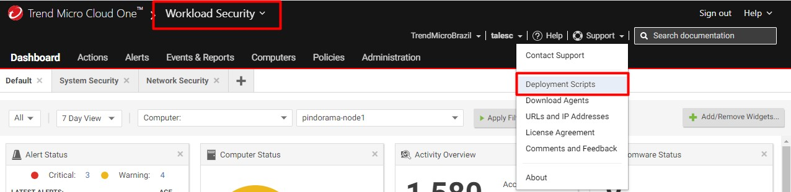
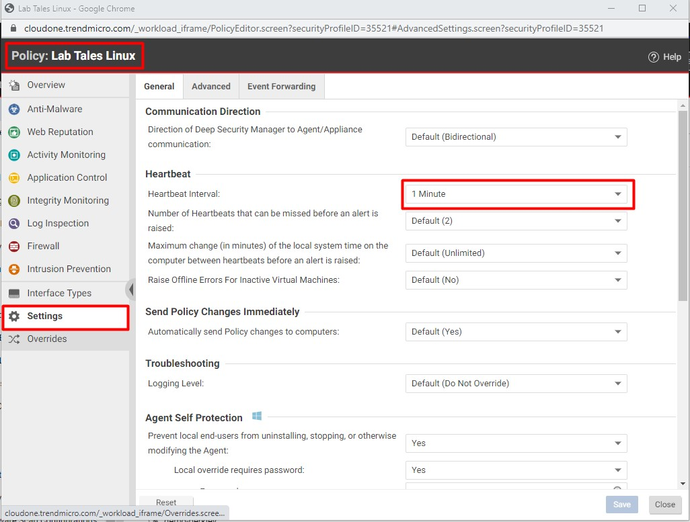

# TestingC1WorkLoadSecurityModules
Um guia de como testar os módulos Cloud One Workload Security.

O Workload Security é composto pelos seguintes modulos:

* Anti-Malware
* Web Reputation	
* Application Control
* Integrity Monitoring
* Log Inspection
* Firewall
* Intrusion Prevention

# Ambiente de teste
* Ubuntu 18.04

Para executar os testes o pré-requisito é possuir uma conta no Cloud One (sem custo) https://cloudone.trendmicro.com/
* Documentação https://cloudone.trendmicro.com/docs/workload-security/

# Instalando o agent

 </img>

 </img>

